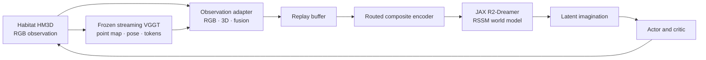

# Do World Models Benefit from 3D Scene Representations?

> A Study on Object Navigation in Photorealistic Environments

**Master's thesis by Luca Sailer**<br>
Institute of Neural Information Processing, Ulm University, 2026

[Project presentation](https://lsailer.github.io/Master-Thesis-3D/) · [Experiment launcher](scripts/slurm/README.md)

## Overview

This repository contains the research code, experiment configurations, and analysis tooling developed for a master's thesis on 3D scene representations in replay-trained world models. The study integrates a frozen streaming VGGT pipeline with a JAX and Flax implementation of R2-Dreamer, then evaluates RGB, geometry-only, token-based, and fused observations on Habitat-Matterport 3D Object Navigation.

The central research question is whether explicit 3D scene features help a world model learn navigation. The strongest result is positive: point-map and camera-pose features are viable inputs on their own, and combining them with RGB improves navigation success and path efficiency in the evaluated single-house settings.

> This is academic research code. The supplied experiment configurations target a SLURM cluster and require separately licensed HM3D assets, local curriculum files, pretrained weights, and substantial GPU resources.

## Main findings

| Finding | Evidence and scope |
| --- | --- |
| 3D features are sufficient for learning | The geometry-only Point Cloud encoder performed comparably to the RGB baseline in the simplest ObjectNav setting. |
| RGB and geometry are complementary | The Pointmap-Pose RGB Hybrid produced the strongest results in the evaluated single-house, single-goal and single-house, six-goal settings. |
| Multi-house scaling remains open | The later hybrid runs were limited by per-step 3D extraction and the available training horizon. |
| Full-curriculum results are not an encoder ranking | Missing goal conditioning confounds Level 4, and evaluation on the training houses does not measure transfer to unseen scenes. |

The thesis additionally contributes:

- a benchmark of five VGGT variants that motivates a bounded-memory streaming encoder.
- a JAX and Flax reimplementation of R2-Dreamer, validated against the PyTorch reference.
- an adapter-based pipeline for comparing appearance, geometry, tokens, and fused inputs while keeping the world-model core fixed.
- YAML-backed SLURM configurations for smoke tests, production runs, and controlled representation comparisons.

## System overview



Each observation adapter declares which fields are stored in replay and which trainable encoder branch consumes them. Frozen VGGT extraction remains outside the world model, while the RSSM, actor, critic, and learning objectives stay comparable across representation variants.

### Thesis representation variants

| Thesis label | Adapter | Replayed observation |
| --- | --- | --- |
| RGB CNN | `rgb` | 64 × 64 RGB image |
| Point Cloud | `pointmap_pose` | 37 × 37 world-point map and 9D camera pose |
| Pointmap-Pose RGB Hybrid | `rgb_pointmap_pose` | RGB image plus world-point map and camera pose |
| Token | `aggregator_pooled*` | Compressed VGGT aggregator-token readout |

Additional point-map, token, and accumulated-house ablations are registered in [`src/adapters/__init__.py`](src/adapters/__init__.py).

### ObjectNav curriculum

| Level | Houses | Goal categories | Purpose |
| --- | ---: | ---: | --- |
| L1 | 1 | 1 | Controlled representation comparison |
| L2 | 1 | 6 | Increased goal diversity |
| L3 | 10 | 1 | Increased scene diversity |
| L4 | 10 | 6 | Combined scene and goal diversity |

## Repository structure

| Path | Purpose |
| --- | --- |
| [`src/main.py`](src/main.py) | Single composition root and training or evaluation entry point |
| [`src/r2dreamer/`](src/r2dreamer/) | JAX and Flax world model, behaviour learning, losses, and checkpointing |
| [`src/vggt/`](src/vggt/) | Streaming VGGT reference path, JAX port, weight transfer, and benchmarks |
| [`src/adapters/`](src/adapters/) | Observation variants and encoder-routing contracts |
| [`src/environments/`](src/environments/) | Habitat ObjectNav and Crafter environment wrappers |
| [`src/buffer/`](src/buffer/) | Replay storage and sequence sampling |
| [`scripts/slurm/`](scripts/slurm/) | Validated YAML experiment launcher and production configurations |
| [`scripts/r2dreamer/`](scripts/r2dreamer/) | Analysis and plotting utilities |
| [`tests/`](tests/) | Unit, integration, parity, and launcher tests |
| [`notebooks/`](notebooks/) | Exploratory analysis and validation notebooks |

## Getting started

### Prerequisites

- Python 3.10 to 3.12, with Python 3.12 recommended
- [`uv`](https://docs.astral.sh/uv/) for environment management
- Linux and an NVIDIA CUDA 12 GPU for Habitat and VGGT experiments
- SLURM for the supplied production launcher
- access to HM3D/HM3DSem scenes and the HM3D ObjectNav v2 episode dataset
- sufficient local storage for datasets, checkpoints, replay buffers, and run artifacts

The complete ObjectNav pipeline is Linux-oriented. macOS resolves a CPU JAX environment but does not install the Habitat dependencies declared for Linux.

### 1. Clone the code and create the environment

```bash
git clone https://github.com/LSailer/Master-Thesis-3D.git
cd Master-Thesis-3D
uv sync --python 3.12
```

Linux installs Habitat-Lab and Habitat-Sim from their upstream repositories as declared in [`pyproject.toml`](pyproject.toml). No `uv.lock` is committed, so a fresh installation resolves the currently available compatible dependencies rather than an exact historical environment.

### 2. Provide the streaming VGGT source

The 3D adapters expect the InfiniteVGGT source tree at `external/InfiniteVGGT/src`:

```bash
git clone https://github.com/AutoLab-SAI-SJTU/InfiniteVGGT.git external/InfiniteVGGT
```

The JAX weight-transfer path loads `lch01/StreamVGGT` from the Hugging Face cache. Download and cache the checkpoint before submitting to a firewalled compute node.

### 3. Provide HM3D and curriculum data

Obtain HM3D scenes and HM3DSem v0.2 ObjectNav episodes through the official [Habitat-Lab dataset instructions](https://github.com/facebookresearch/habitat-lab/blob/main/DATASETS.md), then extract or symlink them into the repository-specific layout:

```text
data/
├── scene_datasets/
│   └── hm3d/
├── datasets/
│   └── objectnav/hm3d/objectnav_hm3d_v2/
│       └── train/
│           ├── train.json.gz
│           └── content/
└── curriculum/
    ├── level1_1house_1goal.json
    ├── level2_1house_6goals.json
    ├── level3_10houses_1goal.json
    └── level4_10houses_6goals.json
```

The Habitat downloads provide the scene and episode data, but not the four thesis-specific curriculum JSON files shown above. Those files must be obtained from the author or recreated from the thesis experiment metadata before any Habitat launch. The current repository does not provide a working generator for them.

The datasets, curriculum JSON files, pretrained weights, checkpoints, and outputs are intentionally not versioned in this repository.

### 4. Validate the setup

```bash
uv run python -m src.main --help

# Render jobs without submitting them.
bash scripts/slurm/launch.sh l1_cnn --dry-run
bash scripts/slurm/launch.sh hybrid_v1 --smoke --dry-run
```

## Running experiments

The supported production path is the YAML-backed launcher. Every variant ultimately calls the same `python -m src.main` entry point.

```bash
# RGB baseline
bash scripts/slurm/launch.sh l1_cnn --smoke-then-prod

# Geometry-only point-map and pose representation
bash scripts/slurm/launch.sh pointmap_pose_l1 --smoke-then-prod

# Fused RGB and 3D representation
bash scripts/slurm/launch.sh hybrid_v1 --smoke-then-prod
```

Use `--env SEED=<value>` to pair representation variants under the same episode-ordering seed. The supplied YAML files use bwUniCluster partition names and resource limits. Adapt [`scripts/slurm/configs/_base.yaml`](scripts/slurm/configs/_base.yaml) before using another cluster. The full configuration schema and launcher options are documented in [`scripts/slurm/README.md`](scripts/slurm/README.md).

### Evaluation

Evaluation uses the same entry point and must run inside a GPU allocation. The adapter must match the checkpoint's training representation, and `MANIFEST.json` should remain beside the run's `checkpoints/` directory.

```bash
srun \
  --partition=gpu_h100_short \
  --exclude=uc3n089 \
  --gres=gpu:1 \
  --cpus-per-task=8 \
  --mem=64G \
  --time=00:30:00 \
  env R2DREAMER_HARD_EXIT_ON_FINISH=1 \
  uv run --no-sync python -m src.main \
    --mode eval \
    --env habitat \
    --adapter rgb \
    --curriculum L1 \
    --checkpoint output/<run>/checkpoints/step_<step>.pkl \
    --episodes 10 \
    --output_dir output/eval/<name> \
    --render_topdown \
    --wandb_project ""
```

Replace the bwUniCluster-specific allocation arguments when running elsewhere. Pass `--random` instead of `--checkpoint` to evaluate the random-policy reference.

### Outputs

Training writes the following artifacts below the selected `output_dir`:

- `metrics.csv` with training and episode metrics.
- `MANIFEST.json` with the resolved model configuration and run status.
- `checkpoints/step_<step>.pkl` with model and optimiser state.
- optional W&B logs, videos, and point-cloud diagnostics.

Evaluation additionally writes `eval_results.json` and, with `--render_topdown`, one top-down map per episode. Generated outputs are ignored by Git.

## Testing

CPU-reachable tests can run without a cluster allocation after the environment is installed:

```bash
JAX_PLATFORMS=cpu uv run --no-sync pytest tests/slurm/test_launch.py -q
uv run pytest tests/r2dreamer/ -m "not gpu" -k "not cross_framework" -q
```

Real Habitat and VGGT tests require a GPU allocation:

```bash
srun --partition=dev_gpu_h100 --gres=gpu:1 --time=00:30:00 \
  uv run pytest tests/vggt/ -q
```

Training, profiling, Habitat, VGGT, and GPU-marked tests must not run directly on a cluster login node.

## Reproducibility notes

- Experiment behaviour is defined jointly by the source revision, adapter, curriculum JSON, YAML launch configuration, seed, replay capacity, and checkpoint.
- W&B is enabled by default for direct training runs. Pass `--wandb_project ""` to disable it, or set `WANDB_MODE=offline` when network access is unavailable.
- Checkpoints do not contain replay-buffer contents. Resumed runs restore model and optimiser state, then recollect transitions before training continues.
- The thesis evaluates training and evaluation episodes from the same selected houses. Its results therefore do not claim unseen-house generalisation.

## Citation

If this repository supports your work, cite the thesis:

```bibtex
@mastersthesis{sailer2026worldmodels3d,
  author  = {Sailer, Luca},
  title   = {Do World Models Benefit from 3D Scene Representations? A Study on Object Navigation in Photorealistic Environments},
  school  = {Ulm University},
  year    = {2026},
  url     = {https://github.com/LSailer/Master-Thesis-3D}
}
```

This project builds on [R2-Dreamer](https://arxiv.org/abs/2603.18202), [InfiniteVGGT](https://arxiv.org/abs/2601.02281), [Habitat-Lab](https://github.com/facebookresearch/habitat-lab), and [HM3D](https://aihabitat.org/datasets/hm3d/). Please cite the original works and datasets where appropriate.

## Acknowledgements

The experiments were performed on bwUniCluster 2.0. The project acknowledges support by the state of Baden-Württemberg through bwHPC.

## License

No open-source license is currently included. Unless a license is added, no permission to use, copy, modify, or redistribute the code is granted beyond rights provided by applicable law. Contact the author regarding reuse.
